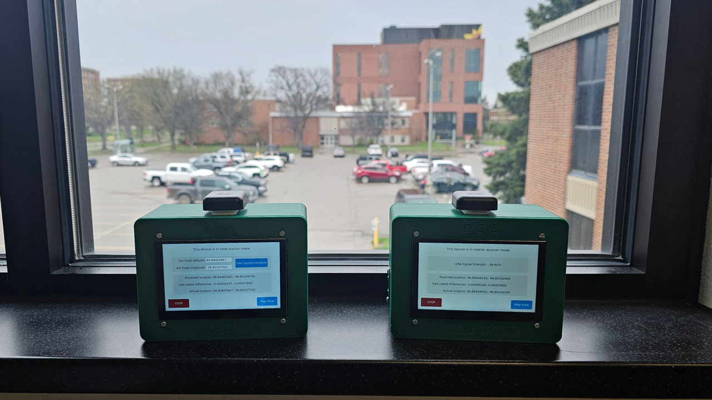
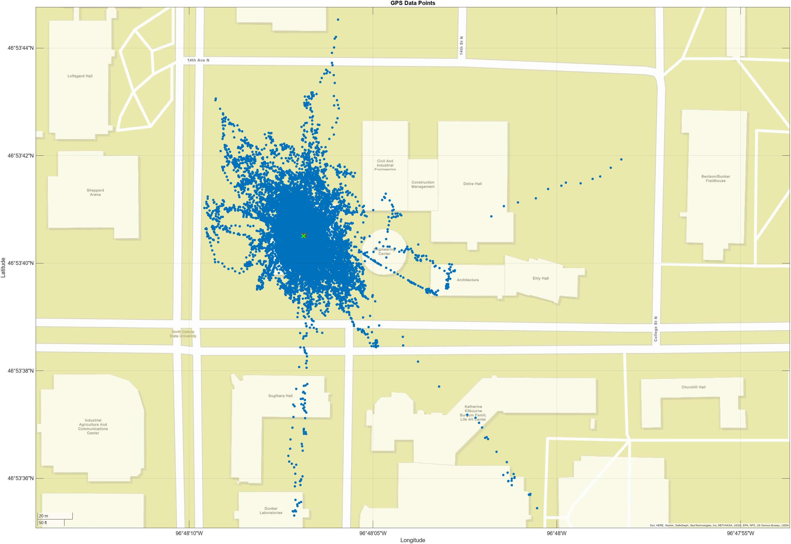
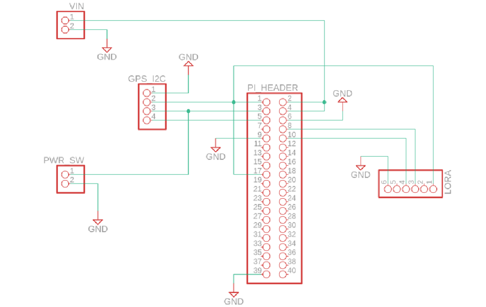
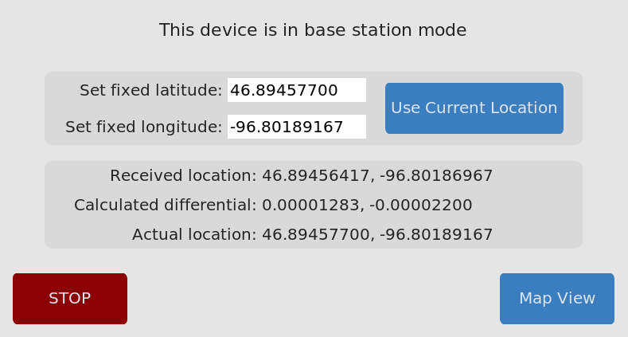
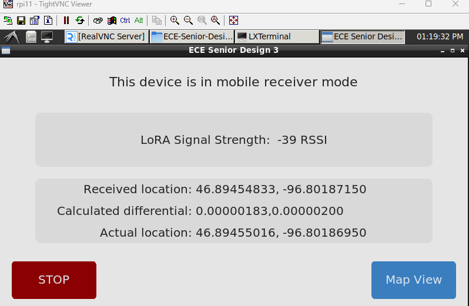
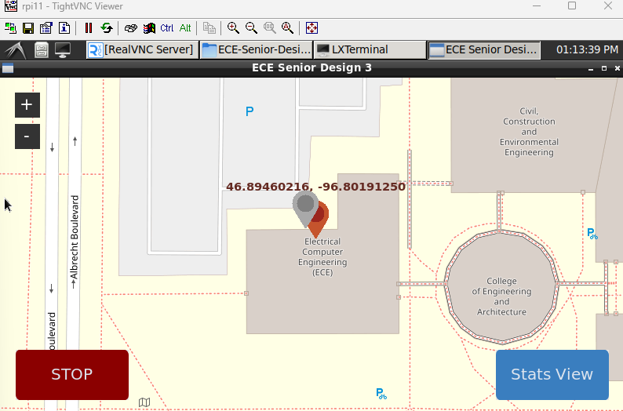

# ECE-Senior-Design-3-code

<p align="center">
  
</p>

### Description of the project
This project features 2 seperate GPS modules to improve the accuracy of location tracking. One GPS module will have a location drift exceeding 100+ feet due to atmospheric disturbances.

<p align="center">
  
</p>

Using a differential GPS configuration can improve speed and accuracy of position acquisition, and correct drifting as shown above.

### Schematic
<p align="center">
  
</p>

### How it's done
Utilizing 2 GPS modules station we are able to track and record data.
* Base station will calculate drift from a "known" location and send that to the mobile station
* Mobile station will then apply the drift value sent from the base station to it's location to improve accuracy

### Hardware used
* Raspberry Pi Zero 2 W
    * Data processing and Display
* MAX 10S GNSS Receiver
    * GPS Receiver
* RYLR406 Transceiver Antenna
    * Node to node communication

Here is a list of the parts we used [Parts List](https://ndusbpos-my.sharepoint.com/:x:/g/personal/brandon_sitarz_ndus_edu/EYj7pP6WB-dNunrzTcp5bb8Bgdo8WEn6w1ga-DmnN949Dw?e=9menLp)

### GUI
<p align="center">
  
</p>
<p align="center">
  
</p>
<p align="center">
  
</p>

## Working with project 

### Installation and Dependencies:
Clone the repository and open a terminal within the directory.

Our application uses [poetry](https://github.com/python-poetry/poetry) to manage python dependiences and environment. On a debian linux machine (raspberry pi), run the following to [install it](https://python-poetry.org/docs/#installing-with-pipx).

First update and upgrade your system packages, then install pipx. Copy the below command and run in the terminal:
```text
    sudo apt update && sudo apt upgrade -y && sudo apt install pipx -y && pipx ensurepath
```
Please reopen your terminal and navigate to the cloned repository.

Now you can install poetry:
```text
    pipx install poetry
```
Set up poetry for our app by typing:
```text
    poetry install
```
You may be prompted to set up a keyring (raspberry pi), this sometimes causes the install to hang, if after 5 minutes you see no progress, use Ctrl+C to cancel the install and run the command again.

You have now completed the setup! You may need to install python3 on your system if it is not already there.

## Running the program
Open a terminal in the project directory
Run:
```text
    poetry run python main.py
```
